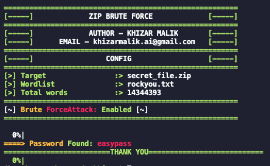
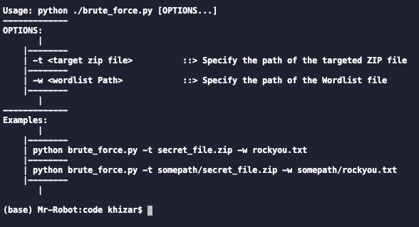

## Zip Brute Force Tool
  
A tool to run brute force attack on any zip file by using a given wordlist (only for educational purpose).

## Installation and Usage

```bash
# Install the required libraries
pip install -r requirements.txt
```

> __Usage__  


## Contact
Author: Khizar Malik   
Email:  Khizarmalik.ai@gmail.com
